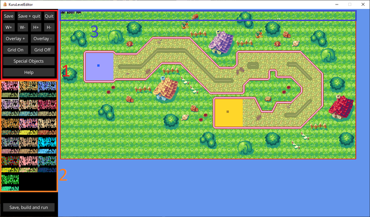
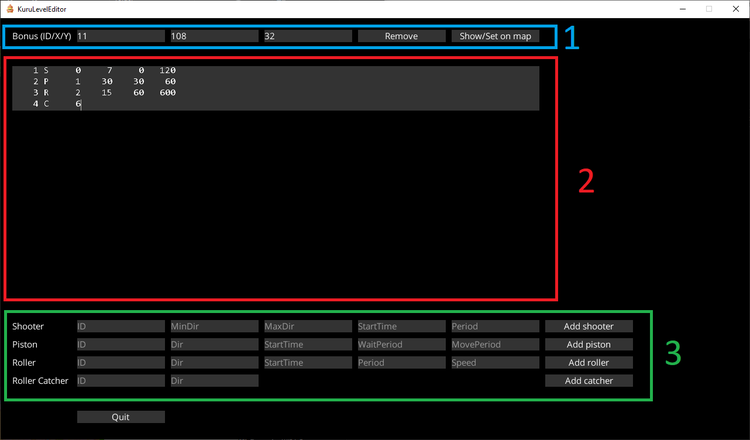

# Level editor for Kuru Kuru Kururin

To edit the levels of Kuru Kuru Kururin, you must place the *Kuru Kuru Kururin (Europe)* ROM into the level editor directory, with the name `input.gba`.

## Layers

Each level is composed of 3 layers:

- **Walls (layer 1)**: describe the walls, the 'safe zones' and the physical elements (starting/healing/ending zones, moving objects, etc)
- **Ground (layer 2)**: describe the ground and/or some overlay elements for the background
- **Background (layer 3)**: describe the background (and sometimes also the ground, for instance in Ocean levels)

You can also choose to edit the MiniMap, that is, the preview of the level.

## The grid editor

Once you have choosen a level and a layer, you can click on *Edit* to open the grid editor.

Each layer is a grid of tiles. The graphics for each tile depends on the world and the layer you are editing (except the wall tiles which are common to all worlds).

You can see all the available tiles by opening the inventory (you can then click on *Help* to see the list of controls).
You can also save some frequent patterns (turns, etc) in your custom inventory.

1. The red zone is the control panel. You can save/quit, change the width and height of the map, show/hide the other layers in the preview, show/hide the grid, and modify the special objects (bonus and moving objects).
 
2. The orange zone is the color palette. Each tile is available in 16 different colors. When you are selecting only one tile, the palette selected is automatically applied to the tile. When you are copying a group of many tiles, you must force the current palette if you want to modify their color (click on the Help button to see the list of controls).
 
3. In the blue zone (first rows of the grid), there might be some special tiles (black tiles with a letter or a number). It defines data for the bonus and moving objects. If you want to modify it, please refer to next section.

## Special Objects

The *Special Objects* menu allows you to change the location of the bonus and to configure the moving objects of the map.
You must edit the wall layer if you want to access it.

1. The blue zone is the configuration of the bonus. The first field (ID) defines which bonus is in the map (values in 1-10 are birds, values in 11-30 are colors and shape skins). The two next fields define the position of the bonus.
If you want to change the position of the bonus, you should click on Show/Set on map.

*NOTE:* Changing the bonus ID or adding a bonus in a level without bonus might not work as expected. You should only change the position of the bonus or remove it.
 
2. The red zone contains the parameters for the moving objects in the map. You can edit it manually, but you should refer to the green zone if you want to add a new moving object configuration or if you want to know what the parameters refer to.
 
3. The green zone allows you to add a new moving object configuration. All the fields are numbers. The ID field should be unique (two different entries should not have the same ID). You can investigate for the other fields ;)

When you are done with the configuration, you can click on *Quit*. This configuration will be encoded in the top rows of the map.

If you want to insert a moving object at a specific location on the map, just put the special tile L at this location, followed by the ID of the configuration to use (for instance, with the configuration of the screenshot above, L2 would be a piston).

*NOTE:* It is also possible to insert a moving object without refering to a configuration, by using a S, P, R or C tile followed by the direction and some other parameters below it. However, you cannot specify all the parameters this way.

## Documentation for each special object

### Shooter

The shooter can only move in the arc delimited by going from angle MinDir to angle MaxDir in the clockwise direction
(MinDir=0 MaxDir=0 means unconstrained).

| Parameter | Description |
| --- | --- |
| MinDir | First angle, in the range from 0 to 7 (0=top, 1=top-right, 2=right, 3=bottom-right, 4=bottom, 5=bottom-left, 6=left, 7=top-left) |
| MaxDir | Second angle, in the range from 0 to 7 (0=top, 1=top-right, 2=right, 3=bottom-right, 4=bottom, 5=bottom-left, 6=left, 7=top-left) |
| StartTime	| Number of frames before the first shoot (+97 frames of animation) |
| Period | Number of frames between two consecutive shoots (+97 frames of animation) |

### Piston

| Parameter | Description |
| --- | --- |
| Dir | Direction, in the range from 0 to 3 (0=top, 1=right, 2=bottom, 3=left) |
| StartTime	| Number of frames before the first move |
| WaitPeriod | Number of frames to wait between two consecutive moves |
| MovePeriod | Number of frames to make a move (round trip) |

### Roller

| Parameter | Description |
| --- | --- |
| Dir | Direction, in the range from 0 to 7 (0=top, 1=top-right, 2=right, 3=bottom-right, 4=bottom, 5=bottom-left, 6=left, 7=top-left) |
| StartTime | Number of frames before the first projectile |
| Period | Number of frames to wait between two consecutive projectiles |
| Speed | Speed of the projectiles in 256ieth of pixel per frame (Speed=256 means one pixel per frame). |

*NOTE:* The base speed of the helirin is 1.5*256 = 384.

### Roller Catcher

| Parameter | Description |
| --- | --- |
| Dir | Direction, in the range from 0 to 7 (0=top, 1=top-right, 2=right, 3=bottom-right, 4=bottom, 5=bottom-left, 6=left, 7=top-left) |
